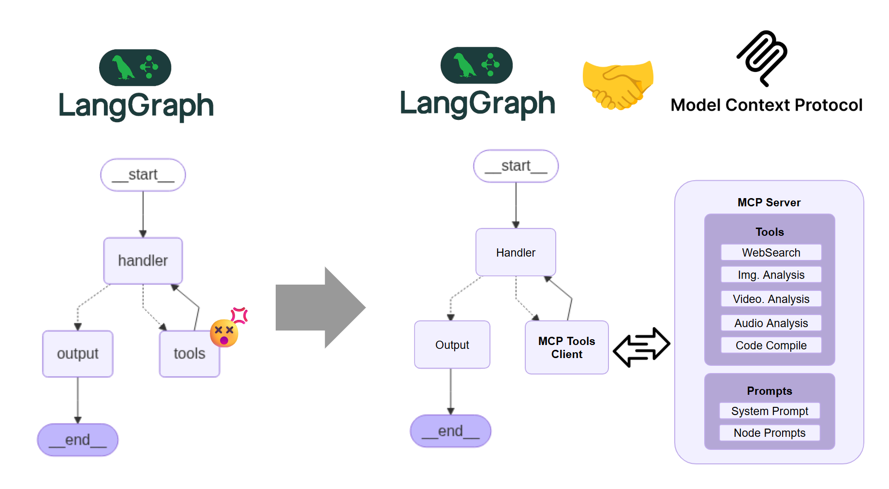
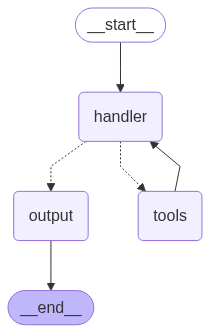
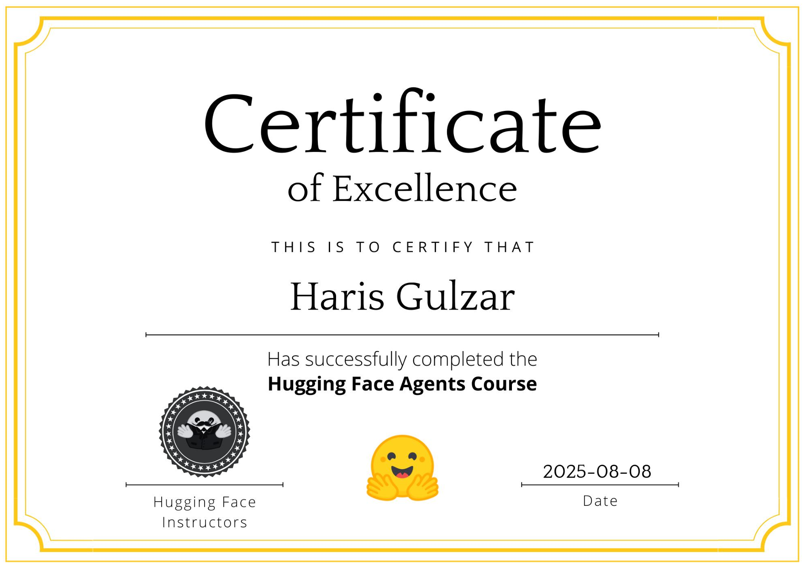

# Implementation of Multi-Input LangGraph Agent and its MCP Implementation

This repository contains a **LangGraph-based multi-input AI agent** that can handle text, images, audio, and video inputs. It uses **OpenAI models** bound to multiple tools for web search, image analysis, audio transcription, and video summarization, executing them dynamically based on the user's query.
Both the simple LangGraph implementation and its MCP Client-Server implementation are done.

### 


## Features

- **Dynamic Tool Execution**: The agent intelligently decides when to call tools via `tool_calls`.
- **Multi-Modal Support**:
  - Web search for up-to-date information.
  - Image analysis using OpenAI vision models.
  - Audio transcription using Whisper.
  - Video summarization (YouTube placeholder implementation).
- **Stateful Workflow** with [LangGraph](https://github.com/langchain-ai/langgraph) managing transitions between tool usage and final output.
- **Batch Processing**: Capable of fetching tasks from an API, running them through the agent, and submitting results.

## Tools Used

- [**LangChain**](https://github.com/langchain-ai/langchain) – Framework for building LLM-powered applications.
- [**LangGraph**](https://github.com/langchain-ai/langgraph) – Graph-based orchestration for multi-step reasoning and tool use.
- [**OpenAI Python Client**](https://github.com/openai/openai-python) – For GPT models, vision, and Whisper.
- [**python-dotenv**](https://github.com/theskumar/python-dotenv) – Environment variable management.
- [**pandas**](https://github.com/pandas-dev/pandas) – Data handling utilities.
- [**requests**](https://github.com/psf/requests) – HTTP client for API interaction.
- [**langsmith**](https://github.com/langchain-ai/langsmith-sdk) – Tracing and debugging for LangChain apps.

## Main Workflow


The core workflow follows this structure:

### 1. **Main Node (`main_node`)**
The LLM is invoked (with tools bound) and may emit `tool_calls`.
### 2. **Tool Node (`ToolNode`)**
  Inside **tool_node**, the following tools are implemented as Python functions under the `@tool` decorator:

#### 🛠️ **compile_code** – For compiling and running code snippets.  
#### 🌐 **openai_web_search** – For performing web searches using OpenAI’s integration.  
#### 🖼️ **image_analyzer_tool** – For analyzing images and extracting useful details.  
#### 🎙️ **audio_transcription_tool** – For converting speech/audio into text.  
#### 🎥 **video_analysis_tool** – For analyzing video content.  

### 4. **Conditional Routing**
If further tool calls are needed, return to `main_node`; otherwise, proceed to output.
### 5. **Output Node (`output_node`)**
Produces the final answer.

This flow is visualized in `graph_diagram.png`.

## How to Run

1. Clone the repository:
   ```bash
   git clone <repo_url>
   cd <repo_dir>
   ```
2. Install dependencies:
   ```bash
   pip install -r requirements.txt
   ```
3. Create a `.env` file with your API keys:
   ```env
   OPENAI_API_KEY=your_key_here
   HF_USERNAME=your_hf_username
   API_URL=https://your.api.url/
   ```
4. Run the agent:
   ```bash
   python multi_input_agent.py
   ```
## Agent Evaluation
The evaluation is done on a subset of the [GAIA: A Benchmark for General AI Assistants](https://arxiv.org/pdf/2311.12983), originally released by META.
The agent is supposed to process the attached files e.g. Pictures, Videos, Audios, Excel Files, Codes etc.

## API Batch Mode
The script’s `run_and_submit_all()` function can fetch multiple tasks from a specified API, run them, and submit answers back.

## HuggingFace Course
This GitHub repo is built as the final project for [HuggingFace AI Agents Course.](https://huggingface.co/learn/agents-course/unit0/introduction)

After finishing the course, one can get the official certificate from HuggingFace.



## License
This project is licensed under the Apache License 2.0.
